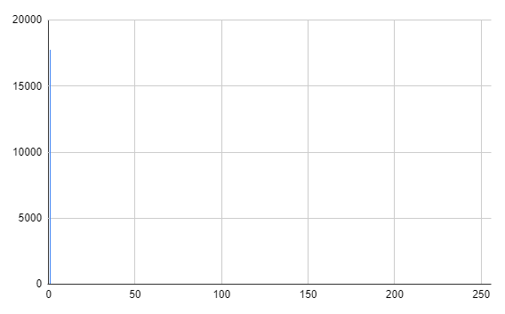
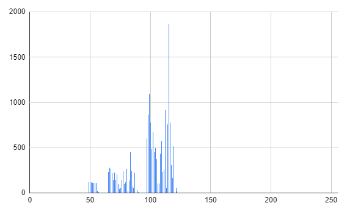
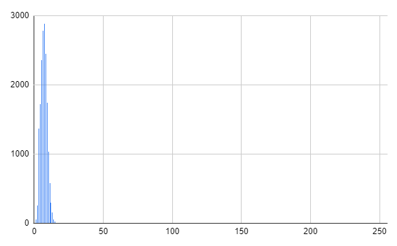
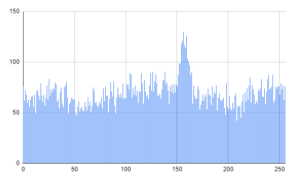
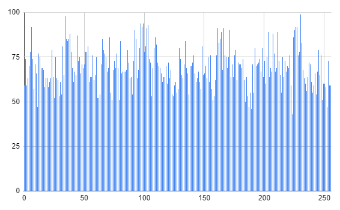
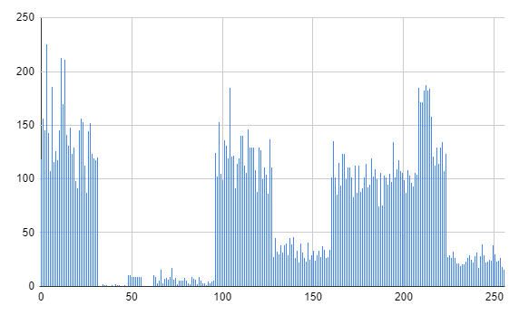
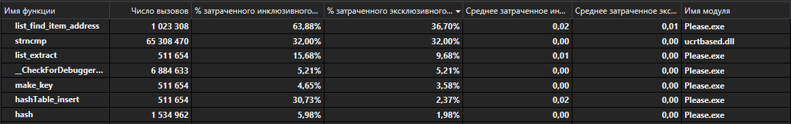
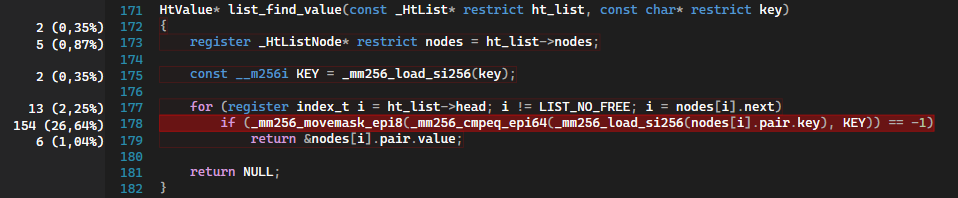
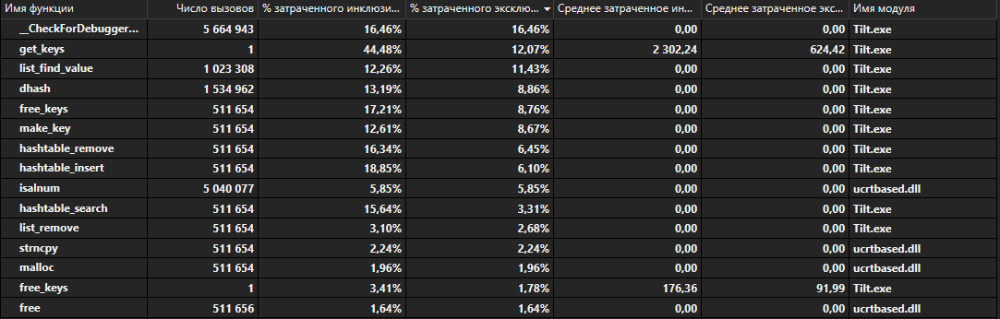

# HT - Hashtable library

A powerful hashtable library with call logging system and error handler.
***
## Description
HT is written in C (C11 standard). The library provides a hashtable data structure and fast and safe API to work with it.
> For better performance **library uses AVX2 instructions**, so your CPU must support them. <br> 
The library can be used only on X64 systems.

## Features
* Handler for error processing

* 3 hashtable modes for different data amount
* Smart logging system for tracking API functions calls
> The logging system is not provided, if you are using MSVC.

## Installation

* Clone the repository:

  `git clone https://github.com/NikitaDzer/Hashtable.git`
* Or download and unzip archive:

  `https://github.com/NikitaDzer/Hashtable/archive/refs/heads/main.zip`

☼ From this moment HT library is ready for your using. ☼


## Usage
Include hashtable library and construct new hashtable.

```c 
HtHashtable *ht_hashtable = construct_hashtable();
```
The library provides 3 functions to operate with data in hashtable: **insert, remove, search**. <br>
Code sample:

```c
const char bro_key[HT_MAX_N_KEY_CHARS] = "bro"; // 32-byte key buffer
HtValue *bro = NULL;

hashtable_insert(ht_hashtable, bro_key, &(HtValue){ .nickname = "Roflan" }); // inserts value with associated key to the hashtable
bro = hashtable_search(ht_hashtable, transform_key("bro"));                  // searches value with passed key

if (control_hashtable() == HT_BAD_KEY) // checks if the key is not found
    printf("No bro in hashtable...\n");
else
{
    printf("My bro's nickname is %s\n.", bro->nickname);
    hashtable_remove(ht_hashtable, transform_key("bro")); // removes key "bro" from the hashtable
}
```
> Hashtable **keys must be in 32-byte buffers with null-terminal chars after the content part** of keys. For example: <br>
> ```bro_key[HT_MAX_N_KEY_CHARS] = "bro"``` <br>
or <br>
```bro_key[32] = ['b','r','o','\0','\0'...'\0']```, where **32 - 3 = 29** null-terminal chars. <br> 
So if you don't provide 32-byte keys, you should to use wrapper ```const char* transform_key(const char *key)```, which is defined in the library.
For better performance we recommend using your own 32-bytes keys, than calling **transform_key**.

The function ```HtResult control_hashtable(void)``` is used to get report about the latest call of any hashtable functions: **construct, destruct, insert, remove, search**. 
In our case we check if such a key exists at all. As a result, the program should print **"My bro's nickname is Roflan."** .

After using a hashtable, you need to clear it with the destructor.

```c
destruct_hashtable(ht_hashtable);
```

***
## Less collisions, more performance
Hash function is one of bottlenecks in our HT library. It has to be fast and to have the most uniform collisions for faster searching in lists.
To eliminate the vulnerability we process 6 hash functions. <br>

We will see hash functions code and their graphs, where along the X-axis is the (hashtable's) list number and along the Y-axis is its length. <br><br>

#### 1. Returns always 1.
```c
unsigned char hash_1(const char *key)
{
    return 1;
}
```
 <br>
As we see, just one list has all **17000** elements. <br><br>

#### 2. Returns ASCII-code of the first letter.
```c
unsigned char hash_letter(const char *key)
{
    return key[0];
}
```
 <br>
The largest list size is over **1800** elements. At least, it's not **17000** elements as with **hash1**. <br><br>

#### 3. Returns key length.
```c
unsigned char hash_len(const char *key)
{
    return strlen(key);
}
```
 <br>
The graph is similar to the Poisson distribution... or the Burj Khalifa. <br> <br>

#### 4. Returns sum of ASCII-codes.
```c
unsigned char hash_sum(const char *key)
{
    unsigned char hash = 0;
    const size_t len = strlen(key);
    
    for (size_t i = 0; i < len; i++)
        hash += key[i];
    
    return hash;
}
```
 <br>
This hash function is much better! But there is a pronounced peak over 160-th list. <br> <br>

#### 5. Ded32 hash function.
```c
unsigned char hash_ded32(const char *key)
{
    hash_t hash = key[0];
    size_t len  = strlen(key);

    for (size_t i = 1; i < len; i++)
        hash = ((hash >> 1) | (hash << (sizeof(unsigned char) * CHAR_BIT - 1))) ^ key[i]; 
                            /* hash << 7 */
    return hash;
}
```
 <br>
Excellent! For its speed, hash function turned out to be quite uniform. <br> <br>


#### 6. Nikita Dzer quick hash function.
```c
unsigned char hash_dzer(const char *key)
{
    const char *const  lastByte = key + strlen(key);
    unsigned char      hash     = 0xDED007;
   
    while (key < lastByte)
        hash = ((hash << 0x8) + (hash >> 0x8)) ^ *key++;
   
    return hash;
}
```
 <br>
The quick hash has 3 bad areas that make the function unpromising.

### Hash functions. Conclusion
It can be seen with the naked eye that the best hash function is **hash_ded32**. Congratulations to the winner! 
## Necks of the bottles
What about HT library bottlenecks? We will try to understand it with Visual Studio 2019 Profiler. <br>
The program **selects all words** from 4 books about Harry Potter, **constructs** a hashtable, **inserts** the words as keys and some values to it, then **searches** values by keys, **removes** all keys and **destructs** a hashtable. <br>
Let's take a look on the result.
> The program was compiled with debug mode in MSVC.




Functions are sorted in **descending order of spent exclusive time**. <br>
There are two bottlenecks: **list_find_item_address** _(later renamed to **list_find_value**)_ and **strncmp**. <br>
How can they be eliminated? We can fix them in two ways: by using **AVX2 instructions** and by making hashtable **more cache-friendly**. 

### AVX2 instructions
The fastest alternative of **strncmp** is **_mm256_cmpeq_epi64** (with **_mm256_movemask_epi8**), but it requires data to be in YMM registers. To load data from memory to registers we use **_mm256_load_si256**. Storing key to hashtable can be done with intrinsic **_mm256_store_si256**. 

#### Before

#### After


### Cache is our friend
If we want to get any data, we don't want it to cross cache-lines. Since in most x64 architectures the cache-line holds 64 bytes of data, we need to **reduce the size of list structure (to 32 byte) and list's key-value pair structure** and **align them on a 32-byte boundary**. 
> So, **if there is a cache-miss** when accessing a list structure or a list's key, then **it will be only one instead of two possible**.


### Bottlenecks elimination
> Don't be scared. In addition to optimizations, there is a small project restructuring.



Amazing result! <br> **strncmp** is no longer in the top of the most voracious functions _(because it doesn't exist in program at all)_. <br>
**list_find_value** is optimized as much as possible. Its exclusive time is almost equal to other library functions, so, it's no longer a bottleneck. 

_**__CheckForDebugger** is VS19 debugger function; **get_keys**, **free_keys** and etc. are HT library private functions_.


### What about a real performance boost?
> HT library was compiled with release mode in MSVC.

Before optimizations: **~270ms**. <br>
After  optimizations: **~140ms**. <br>
Performance boost: **~+93%**. 

> Unfortunately, it's hard to say, how cache optimizations influenced the final result. But aligning everything is definitely not good: **data becomes less spatially local**, especially, if there is a lot of data.

### And the last. Was it worth all that days?
Our efficiency: **E = (1.93 / 10) * 1000 = 193**. <br>
But it's just very approximate numbers. **Of course, it was worth all wasted days to f@ck that sh1t**.


***
## Who? 
HT Hashtable library is made by [Nikita Dzer](https://vk.com/id188977770). <br>
With Love ♥.
